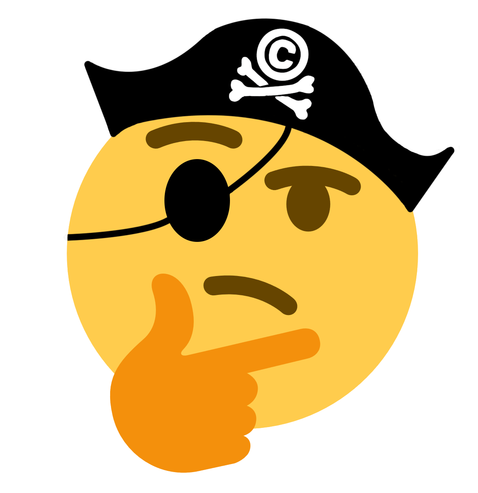
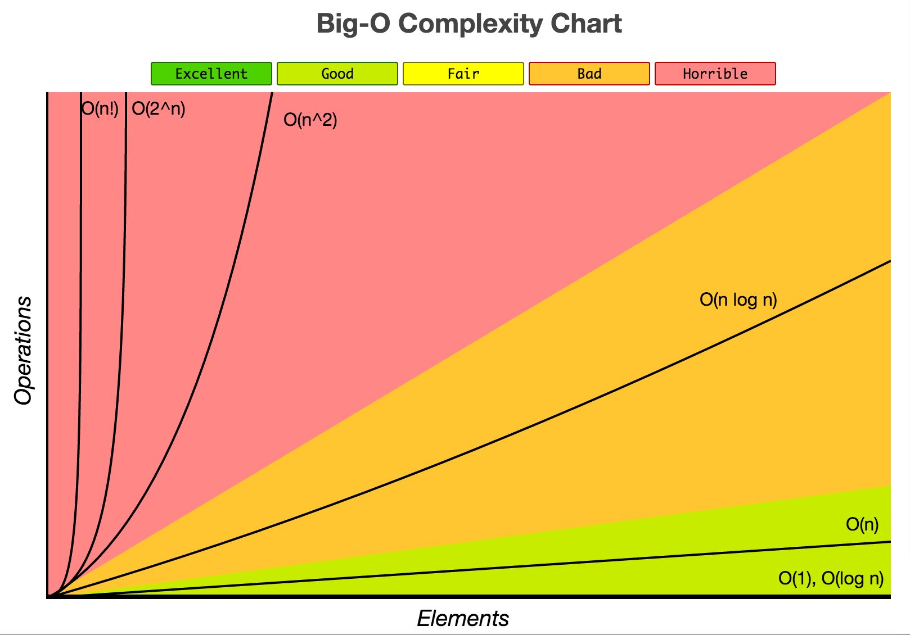
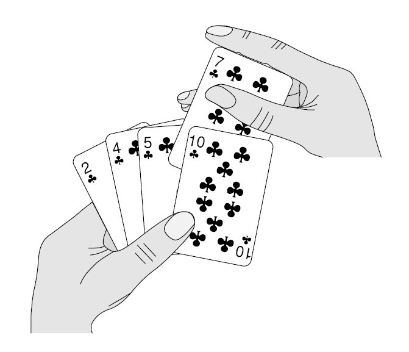

name: cover
class: center, middle, s-inverse, l-cover
layout: true

---
template: cover

# Algorithm FriYAY! 4/27/18

<div class="center">

</div>

--
<br>
<br>

## Bubble Sort + Big O Notation

---
layout: false
# What is an Algorithm?
--

<div class="center">
    
</div>
--

- A set of steps to accomplish a task
--

- Example: 
    - How to make cup noodles
    - How to get home from ATV
    - How to make a box from *'s

---

# Why do I need to study algorithms?

- Think like a computer scientist
--

    - Create and optimize interesting and useful programs
--
    - Knowing coding syntax itself won't make you a good programmer, understanding how to think like one will
<div class="center">
    
</div>

---
# Why do I need to study algorithms?

- Whiteboarding Skillz
--

    - Pass that technical interview!
--

    - Get the job!
<div class="center">
    
</div>
---

# Warm Up!

- If you had an infinite supply of water and a 5-liter and 3-liter bucket, how would you measure exactly 4 liters? The buckets do not have any intermediate scales.

--

    - Fill the 5-liter bucket first.     
    - Then using that bucket fill the 3-liter bucket being careful not to spill any. 
    - This leaves 2 liters in the 5-liter bucket. Now throw away the water in the 3-liter bucket and refill with the remaining contents of the bigger bucket. 
    - Once again fill the 5-liter bucket and fill the second 3-liter bucket. 
    - Fill the 5-liter bucket with the water from the 2 3-liter buckets. 
    - This will leave you 4 liters in the 5-liter bucket.

---

template: cover

# Bubble Sort!
<div class="center">
    
</div>

---

# Bubble Sort
- Simplest (most infamous) sorting algorithm
--

- Sort array in ascending order
--

- Example: [9,2,4,3] => [2,3,4,9]
--

- Grab a partner and some whiteboard space (or paper), draw out how you would approach this problem. This is called pseudo-coding!
--

- No cheating! Yes, I know you can find the answer online... but the point is to practice like you would perform during an interview. 👀
--

- And if you know the answer already, you will still need to explain your logic/thought process.

---

# Coding time! Let's try pair programming!
- https://bit.ly/2I3JIC2 (Schology Algorithm FriYay 4/27/18)
- bubble_sort_template.py

```py
def bubble_sort(arr):
    #write your code here
    return

input_arrays = [[],[9, 8, 7, 6, 5, 4, 3, 2, 1]...]
sorted_arrays = [[],[1, 2, 3, 4, 5, 6, 7, 8, 9]...]
 
for i in range(len(input_arrays)):
    print("")
    print(" Input: " + str(input_arrays[i]))
    output_array = bubble_sort(input_arrays[i])
    print("Output: " + str(output_array))
    test_passed = "true" if output_array == sorted_arrays[i] else "false"
    print("Test Passed? " + test_passed)
    
```
---
# A Solution
```py
def bubble_sort(arr):
    swapped = True
    while (swapped):
        swapped = False
        for i in range(len(arr)-1):
            if arr[i] > arr[i+1]:
                arr[i], arr[i+1] = arr[i+1], arr[i]
                swapped = True
    return arr
``` 
---
# Does the job but...

- Bubble sort is pretty slow.
--

- How do we know this? 
    - You can maybe guess from the loop inside the loop

---
template: cover
# Big O Notation!
<div class="center">
    
</div>
---

# Big O Notation
- Used to describe the performance/complexity of an algorithm
--

- Specifically describes the worst case scenario (i.e. the longest time/most memory your algorithm may take to process your data)
--

- O(1) describes an algorithm that will always execute in the same time (or space) regardless of the size of the input data set. CONSTANT
--

- O(n) describes an algorithm whose performance will grow LINEARLY and in direct proportion to the size of the input data set. Common in single loops.
--

- O(n^2) represents an algorithm whose performance is directly proportional to the square of the size of the input data set. Common in nested loops. 
--

- http://bigocheatsheet.com/

---
#Bubble Sort is 0(n^2)

- Why? How can we tell?
--
- Nested loops!

--
- Worst case scenario is if array is completely descending and you're sorting it to be ascending [4,3,2,1] => [1,2,3,4]
--

- You will need to make n iterations through the array, and each iteration you need to check all n elements O(n*n) = O(n^2)
--

- There must be a better way to sort an array!

---

template: cover
# Next time: Insertion Sort + Merge Sort!
<div class="center">
    
</div>

## Hint: Merge sort is O(nlog(n))

---
# Resources
- https://www.youtube.com/watch?v=8Kp-8OGwphY
- https://medium.com/basecs/bubbling-up-with-bubble-sorts-3df5ac88e592
- http://interactivepython.org/runestone/static/pythonds/SortSearch/TheBubbleSort.html
- https://rob-bell.net/2009/06/a-beginners-guide-to-big-o-notation/
- http://bigocheatsheet.com/
